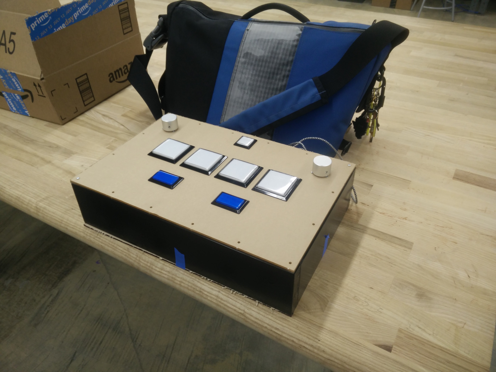

# Welcome

Welcome to the Custom Arcade Controller tutorial! This tutorial is intended for the construction
of a controller for [Sound Voltex](https://en.wikipedia.org/wiki/Sound_Voltex), but the
fundamentals will be applicable for any custom arcade controller.

## Sound Voltex

[Sound Voltex](https://en.wikipedia.org/wiki/Sound_Voltex) is a rhytmn game with
a unique controller. For home play, it may be difficult or expensive to acquire a
controller. For the more technically inclined, building a custom controller may
controller may be the best option.
